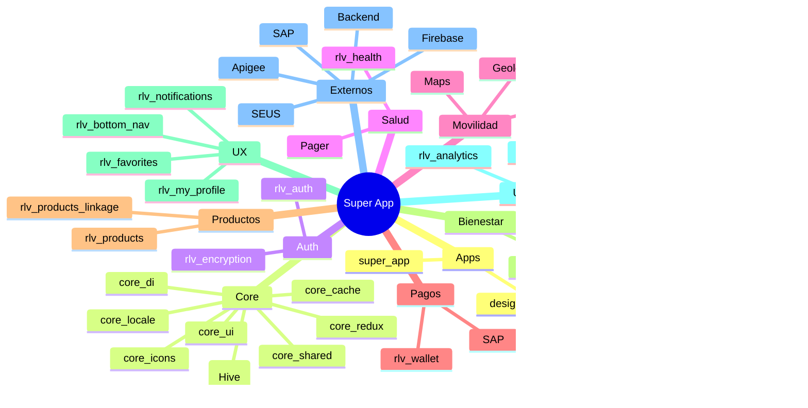

<div style="text-align:left">
    
</div>

# Arquitectura de la Super App - GPS Principal

Este documento sirve como **GPS arquitectónico** para navegar el ecosistema de la Super App Seguros SURA y guiar el desarrollo cuando lleguen nuevas historias de usuario.

## 🎯 Visión General del Sistema

### Propósito Principal

La **Super App de Seguros SURA** es una solución móvil estratégica multiplataforma (Android/iOS) desarrollada en Flutter/Dart que actúa como habilitador de servicios digitales para administrar procesos y planes de la compañía de seguros SURA. Permite a los clientes:

- Acceder de forma ágil y autogestionable a los seguros contratados
- Gestionar servicios de prestación y asistencia
- Gestionar su bienestar mediante el fomento de hábitos saludables
- Acceder a programas de entrenamiento y prevención de riesgos

### Distribución del Ecosistema

- Arquitectura: Monorepo con Arquitectura Limpia
- Total de módulos de negocio: 27 módulos
- Paquetes core: 9 paquetes compartidos
- Aplicaciones: 2 (Super App principal + Design System Book)

### Módulos/Dominios Críticos

1. `apps/super_app`: Aplicación principal que integra todos los módulos de negocio
2. `packages/core_ui`: Sistema de diseño, componentes visuales base y temas
3. `modules/rlv_health`: Módulo de salud con integración a Pager SDK para atenciones virtuales
4. `modules/rlv_mobility`: Módulo de movilidad con gestión de seguros vehiculares
5. `modules/rlv_auth`: Módulo de autenticación con integración a SEUS (sistema interno SURA)

### Diagrama de Arquitectura de Alto Nivel

```mermaid
graph TB
    subgraph "Usuarios Finales"
        U1[Usuario iOS]
        U2[Usuario Android]
    end

    subgraph "Sistemas Externos SURA"
        SEUS[SEUS - Auth Service<br/>Tokens & Sesiones]
        SAP[SAP - Payment Gateway<br/>Pasarelas de Pago]
        APIGEE[Apigee Gateway<br/>Puertas de Enlace]
        BACKEND[Microservicios Backend<br/>Spring WebFlux]
    end

    subgraph "Servicios Firebase"
        FIRESTORE[Cloud Firestore]
        FIREBASE_ANALYTICS[Firebase Analytics]
        REMOTE_CONFIG[Remote Config]
        FCM[Firebase Cloud Messaging<br/>Notificaciones Push]
        CRASHLYTICS[Firebase Crashlytics]
        PERFORMANCE[Firebase Performance]
    end

    subgraph "SDKs Externos"
        PAGER[Pager SDK<br/>Atenciones Virtuales Salud]
        LONGEVO[Longevo SDK<br/>Bienestar]
        MEDALLIA[Medallia SDK<br/>Feedback]
    end

    subgraph "Super App Frontend - Flutter"
        SUPER_APP[Super App Principal]
        
        subgraph "Core Packages"
            CORE_UI[core_ui]
            CORE_REDUX[core_redux]
            CORE_DI[core_di]
            CORE_CACHE[core_cache]
            CORE_SHARED[core_shared]
            CORE_PERSISTENCE[core_persistence]
        end
        
        subgraph "Módulos de Negocio"
            RLV_AUTH[rlv_auth<br/>Autenticación]
            RLV_HEALTH[rlv_health<br/>Salud]
            RLV_MOBILITY[rlv_mobility<br/>Movilidad]
            RLV_PRODUCTS[rlv_products<br/>Productos]
            RLV_WALLET[rlv_wallet<br/>Billetera]
            RLV_LIFE[rlv_life]
            RLV_RESIDENCE[rlv_residence]
            RLV_PETS[rlv_pets]
            RLV_CLAIMS[rlv_claims]
            RLV_CERTIFICATES[rlv_certificates]
            RLV_VIVE_MAS_REWARDS[rlv_vive_mas_rewards]
            RLV_LONGEVO[rlv_longevo]
            RLV_MY_PROFILE[rlv_my_profile]
            RLV_NOTIFICATIONS[rlv_notifications]
            RLV_FAVORITES[rlv_favorites]
            RLV_ANALYTICS[rlv_analytics]
            RLV_CONFIG[rlv_config]
        end
    end

    subgraph "CI/CD & DevSecOps"
        AZURE[Azure Pipelines]
        SONAR[SonarQube<br/>Análisis Estático]
        CHECKMARX[Checkmarx<br/>Seguridad]
        TESTFAIRY[TestFairy<br/>Distribución Beta]
        SHOREBIRD[Shorebird<br/>Code Push]
    end

    U1 --> SUPER_APP
    U2 --> SUPER_APP
    
    SUPER_APP --> CORE_UI
    SUPER_APP --> CORE_REDUX
    SUPER_APP --> CORE_DI
    SUPER_APP --> CORE_PERSISTENCE
    
    SUPER_APP --> RLV_AUTH
    SUPER_APP --> RLV_HEALTH
    SUPER_APP --> RLV_MOBILITY
    SUPER_APP --> RLV_PRODUCTS
    SUPER_APP --> RLV_WALLET
    
    RLV_AUTH --> SEUS
    
    RLV_HEALTH --> PAGER
    RLV_HEALTH --> FIRESTORE
    
    SUPER_APP --> APIGEE
    SUPER_APP --> BACKEND
    RLV_WALLET --> SAP
    
    APIGEE --> BACKEND
    
    SUPER_APP --> FIRESTORE
    SUPER_APP --> FIREBASE_ANALYTICS
    SUPER_APP --> REMOTE_CONFIG
    SUPER_APP --> FCM
    SUPER_APP --> CRASHLYTICS
    SUPER_APP --> PERFORMANCE
    SUPER_APP --> MEDALLIA
    SUPER_APP --> LONGEVO
    
    AZURE --> SUPER_APP
    AZURE --> SONAR
    AZURE --> CHECKMARX
    AZURE --> TESTFAIRY
    
    classDef frontend fill:#e1f5fe
    classDef backend fill:#f3e5f5
    classDef external fill:#fff3e0
    classDef firebase fill:#fff9c4
    classDef devops fill:#f1f8e9
    classDef core fill:#c8e6c9
    
    class SUPER_APP,CORE_UI,CORE_REDUX,CORE_DI,CORE_CACHE,CORE_SHARED,CORE_PERSISTENCE frontend
    class RLV_AUTH,RLV_HEALTH,RLV_MOBILITY,RLV_PRODUCTS,RLV_WALLET,RLV_LIFE,RLV_RESIDENCE,RLV_PETS,RLV_CLAIMS,RLV_CERTIFICATES,RLV_VIVE_MAS_REWARDS,RLV_LONGEVO,RLV_MY_PROFILE,RLV_NOTIFICATIONS,RLV_FAVORITES,RLV_ANALYTICS,RLV_CONFIG core
    class SEUS,SAP,APIGEE,BACKEND backend
    class PAGER,LONGEVO,MEDALLIA external
    class FIRESTORE,FIREBASE_ANALYTICS,REMOTE_CONFIG,FCM,CRASHLYTICS,PERFORMANCE firebase
    class AZURE,SONAR,CHECKMARX,TESTFAIRY,SHOREBIRD devops
```



## 🗂️ Mapa de Módulos por Dominio de Negocio

### Dominio: Aplicaciones Principales

#### apps/super_app
- Stack principal: Flutter 3.32.2+, Dart 3.3.0+
- Función: Aplicación móvil principal que integra todos los módulos de negocio
- Estado: ✅ Producción - Versión 12.3.0+447
- Características clave:
  - Manejo de estado con Redux
  - Routing con GoRouter 12.1.3
  - Deep linking con App Links
  - Code Push con Shorebird
  - Multi-flavor (dev, qa, lab, prod)

#### apps/design_system_book
- Stack principal: Flutter
- Función: Catálogo interactivo del sistema de diseño
- Estado: ✅ Desarrollo activo
- Características clave: Documentación y testing de componentes visuales

### Dominio: Core Packages (Infraestructura Compartida)

#### packages/core_ui
- Función: Sistema de diseño, temas, recursos visuales, componentes base reutilizables
- Dependencias clave: carousel_slider, dropdown_button2, timeline_tile, webview_flutter, image_picker, file_picker, fl_chart
- Estado: ✅ Crítico - Base visual de toda la app

#### packages/core_redux
- Función: Configuración de Redux para manejo de estado centralizado
- Estado: ✅ Crítico

#### packages/core_di
- Función: Inyección de dependencias con GetIt
- Estado: ✅ Crítico

#### packages/core_cache
- Función: Gestión de caché y almacenamiento temporal
- Estado: ✅ Activo

#### packages/core_persistence
- Función: Persistencia de datos local (SharedPreferences, Secure Storage, Hive)
- Estado: ✅ Activo

#### packages/core_locale
- Función: Internacionalización y localización
- Estado: ✅ Activo

#### packages/core_shared
- Función: Utilidades compartidas y modelos comunes
- Estado: ✅ Activo

#### packages/core_icons
- Función: Iconos personalizados de SURA
- Estado: ✅ Activo

### Dominio: Autenticación y Seguridad

#### modules/rlv_auth
- Función: Gestión de autenticación, sesiones y biometría
- Stack: local_auth, flutter_secure_storage, rlv_encryption
- Estado: 🔴 Crítico - Transversal

### Dominio: Seguros y Productos

#### modules/rlv_products
- Función: Gestión de productos de seguros contratados
- Estado: ✅ Crítico

#### modules/rlv_products_linkage
- Función: Vinculación y asociación de productos
- Estado: ✅ Activo

#### modules/rlv_health
- Función: Seguros de salud con atenciones virtuales en tiempo real
- Stack: Pager SDK, Cloud Firestore, Medallia
- Estado: 🔴 Crítico

#### modules/rlv_mobility
- Función: Seguros de movilidad vehicular
- Stack: Google Maps Flutter, Geolocator, Places SDK, Cloud Firestore
- Estado: 🔴 Crítico

#### modules/rlv_life / rlv_residence / rlv_pets
- Función: Seguros específicos de vida, hogar, mascotas
- Estado: ✅ Activo

### Dominio: Servicios al Cliente

#### modules/rlv_wallet
- Función: Billetera digital y pagos (SAP)
- Estado: 🔴 Crítico

#### modules/rlv_claims / rlv_certificates / rlv_help
- Función: Siniestros, certificados, soporte
- Estado: ✅ Activo

### Dominio: Bienestar y Recompensas

#### modules/rlv_vive_mas_rewards / rlv_longevo
- Función: Bienestar, recompensas y programas externos
- Estado: ✅ Activo

### Dominio: Experiencia de Usuario

#### modules/rlv_my_profile / rlv_notifications / rlv_favorites / rlv_bottom_nav
- Función: Perfil, notificaciones, favoritos, navegación
- Estado: ✅ Crítico/Activo

### Dominio: Utilidades

#### modules/rlv_analytics / rlv_crashlytics / rlv_performance_monitoring / rlv_config / rlv_reference_lists / rlv_encryption
- Función: Observabilidad, configuración, listas de referencia, seguridad
- Estado: ✅ Transversal

### Mapa Visual (Mindmap)



## ⚙️ Stack Tecnológico Global

### Framework & Lenguaje
| Componente | Versión |
|------------|---------|
| Dart SDK | 3.3.0 |
| Flutter SDK | 3.32.2 |

### Core Paquetes Internos
| Paquete | Versión |
|---------|---------|
| core_ui | 0.0.1 |
| core_redux | 0.0.1 |
| core_di | 0.0.1 |
| core_cache | 0.0.1 |
| core_persistence | 0.0.1 |
| core_locale | 0.0.1 |
| core_shared | 0.0.1 |
| core_icons | 0.0.1 |

### Librerías Principales
| Librería | Versión |
|----------|---------|
| redux | 5.0.0 |
| go_router | 12.1.3 |
| dio | 5.8.0+1 |
| equatable | 2.0.7 |
| freezed_annotation | 3.0.0 |
| json_annotation | 4.9.0 |
| build_runner | 2.4.15 |
| freezed | 3.0.6 |
| json_serializable | 6.9.5 |
| mockito | 5.4.6 |
| permission_handler | 12.0.0+1 |
| hive | 2.2.3 |
| local_auth | 2.3.0 |
| flutter_secure_storage | 9.2.4 |
| carousel_slider | 5.0.0 |
| dropdown_button2 | 2.3.9 |
| timeline_tile | 2.0.0 |
| webview_flutter | 4.13.0 |
| image_picker | 1.1.2 |
| file_picker | 10.1.9 |
| fl_chart | 1.0.0 |

### Firebase
| Servicio | Versión |
|----------|---------|
| firebase_core | 3.12.1 |
| firebase_analytics | 11.4.4 |
| firebase_crashlytics | 4.3.4 |
| firebase_performance | 0.10.1+4 |
| firebase_remote_config | 5.4.2 |
| cloud_firestore | 5.6.5 |

### SDKs Externos
| SDK | Versión |
|-----|---------|
| pager_sdk | 1.4.0 |
| longevo_flutter_sdk | v0.0.12 |
| medallia_digital_flutter | 4.4.2 |
| shorebird_code_push | 2.0.4 |

### Herramientas
| Tool | Versión |
|------|---------|
| melos | 6.3.3 |
| test_cov_console | 0.2.2 |
| flutter_lints | 6.0.0 |

### Librerías de Desarrollo
| Librería | Versión | Uso |
|----------|---------|-----|
| flutter_test | SDK | Testing unitario y de widgets |
| build_runner | 2.4.15 | Generación de código |
| mockito | 5.4.6 | Mocks para testing |
| flutter_lints | 6.0.0 | Análisis estático de código |
| melos | 6.3.3 | Gestión de monorepo |
| test_cov_console | 0.2.2 | Reporte de cobertura |
| freezed | 3.0.6 | Generación de clases inmutables |
| json_serializable | 6.9.5 | Serialización JSON |
| hive_generator | 2.0.1 | Generación de adaptadores Hive |
| hive_test | 1.0.1 | Testing para Hive |
| get_it | 7.7.0 | Service locator (dev) |

## 🔗 Puntos de Integración Críticos

- SEUS (Auth) vía `rlv_auth`
- SAP (Pagos) vía `rlv_wallet`
- Apigee (Gateway) para microservicios Spring WebFlux
- Firebase (Analytics, Crashlytics, Performance, Firestore, Remote Config, FCM)
- SDKs externos: Pager, Longevo, Medallia

## 🔐 Seguridad e Integración

| Canal | Protocolo | Estado |
|-------|-----------|--------|
| SEUS Auth | REST + JWT | ✅ |
| SAP Pagos | REST | ✅ |
| Apigee APIs | REST | ✅ |
| Firestore | gRPC/WebSocket | ✅ |
| FCM | FCM Protocol | ✅ |
| Pager SDK | SDK Propietario | ✅ |
| Longevo SDK | SDK Propietario | ✅ |

## 🧪 Testing

- Cobertura mínima: 80%
- Unitarios: Todos los módulos
- Widgets: core_ui + módulos UI críticos
- Seguridad: SAST (Checkmarx), SonarQube

### Comandos Clave
```bash
cd apps/super_app
melos bootstrap
melos run all_tests
flutter analyze
dart run build_runner build --delete-conflicting-outputs
flutter gen-l10n
sh coverage_validation.sh
```

## ⚠️ Deuda Técnica

- Integración cross-módulo limitada (mejorar pruebas de interacción en features críticas)
- Revisión de actualizaciones (go_router > v12) pendiente análisis de breaking changes
- Falta formalización de reglas Firestore documentadas
- Ausencia de matriz de compatibilidad de SDKs externos

## 📦 Dependencias Críticas (Riesgo Resumido)

| Dependencia | Versión | Riesgo |
|-------------|---------|--------|
| Flutter | 3.32.2 | Bajo |
| Dart | 3.3.0 | Medio (actualización posible) |
| go_router | 12.1.3 | Medio (cambios mayores en v13+) |
| pager_sdk | 1.4.0 | Externo |
| medallia_digital_flutter | 4.4.2 | Bajo |

## 🔧 Guía Rápida Desarrollo

### Nueva Feature (ej: rlv_health)
1. Rama: `git checkout -b feature/<dev>/<HU>`
2. Código en `domain/middlewares`, `presentation` y posible integración en `apps/super_app`
3. Tests + coverage >= 80%
4. `dart run build_runner build`
5. PR con Conventional Commits (inglés)

### Nuevo Widget Reutilizable (core_ui)
1. Agregar en `packages/core_ui/lib/...`
2. Test en `packages/core_ui/test`
3. Documentar en `apps/design_system_book`

### Nueva API (ej: rlv_products)
1. Datasource remoto
2. Repository impl
3. Middleware Redux
4. Actions/Reducers
5. Tests con mocks

## Componentes que Cambian Juntos

| Componente | Revisar También |
|------------|-----------------|
| rlv_auth | `apps/super_app/lib/store` |
| core_ui | `apps/design_system_book` |
| rlv_health | rlv_products, rlv_my_profile |
| rlv_mobility | rlv_products |
| Firebase configs | rlv_config, rlv_analytics |
| core_redux | Estados en módulos |

## 📋 Documentación Existente (Repositorio)

Imágenes disponibles (referencia dentro del repo de la app):
- `./1065-relevant_superapp_frontend-fr/docs/arquitectura_superapp_seguros.png`
- `./1065-relevant_superapp_frontend-fr/docs/contexto_superapp_seguros.png`
- `./1065-relevant_superapp_frontend-fr/docs/ci_cd_superapp_seguros.png`
- `./1065-relevant_superapp_frontend-fr/docs/contenedores_superapp_seguros.png`

Otros:
- `./1065-relevant_superapp_frontend-fr/docs/pull_request_template.md`
- `./1065-relevant_superapp_frontend-fr/README.md`
- `./1065-relevant_superapp_frontend-fr/CONTRIBUTING.md`

## Próximos Pasos

- Documentar flujos: Login (SEUS), Pago SAP, Atención Pager, Notificaciones FCM
- Diagramas C4 (Contenedores / Componentes) para segmentar responsabilidades
- Exportar y versionar reglas de seguridad Firestore
- Crear matriz de compatibilidad y actualización de SDKs (Pager, Longevo, Medallia, Shorebird)
- Evaluar migración futura de go_router > v12 (análisis impacto)
- Formalizar guía de actualización de dependencias trimestral
- Documentar estrategia de manejo de tokens (renovación, expiración) en `rlv_auth`

---
**Desarrollado por Relevant**  
© Seguros SURA 2025
