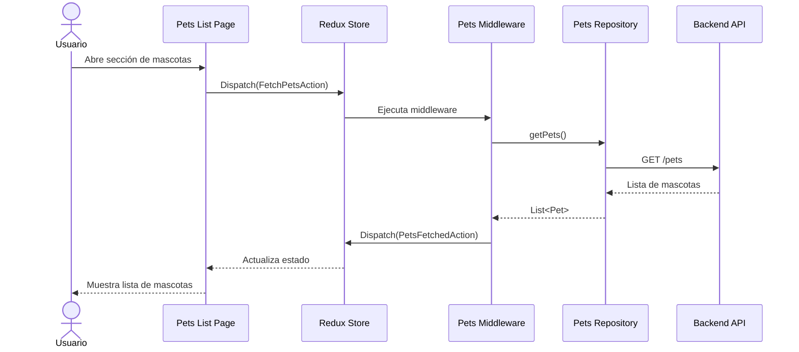
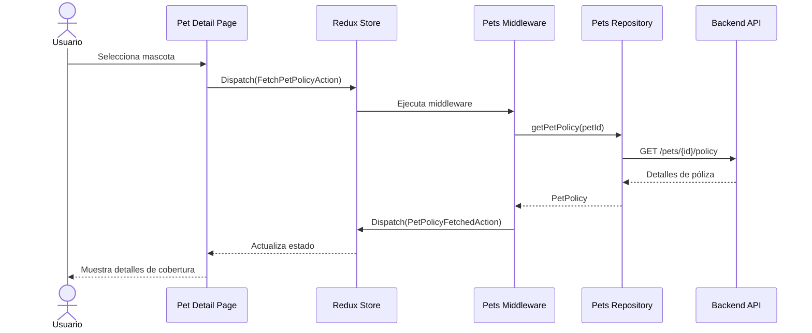

# Componente: rlv_pets

## 📋 Información General

| Atributo | Valor |
|----------|-------|
| **Nombre** | rlv_pets |
| **Tipo** | Módulo de Negocio |
| **Ruta** | `modules/rlv_pets` |
| **Versión** | 0.0.1 |
| **Estado** | ✅ Activo |
| **Dominio** | Seguros y Productos |
| **Responsable** | Equipo Relevant |

## 🎯 Propósito

El módulo **rlv_pets** gestiona los seguros para mascotas dentro de la Super App de Seguros SURA. Permite a los usuarios visualizar, consultar y administrar las pólizas de seguros contratadas para sus mascotas (perros, gatos, etc.).

### Funcionalidades Principales

- Visualización de pólizas de seguros de mascotas activas
- Consulta de detalles de cobertura
- Gestión de información de mascotas aseguradas

## 🏗️ Arquitectura

### Estructura del Módulo

```
modules/rlv_pets/
├── lib/
│   ├── data/
│   │   ├── datasources/
│   │   │   └── pets_remote_datasource.dart
│   │   ├── models/
│   │   │   ├── pet_model.dart
│   │   │   └── pet_policy_model.dart
│   │   └── repositories/
│   │       └── pets_repository_impl.dart
│   ├── domain/
│   │   ├── entities/
│   │   │   ├── pet.dart
│   │   │   └── pet_policy.dart
│   │   ├── middlewares/
│   │   │   └── pets_middleware.dart
│   │   └── repositories/
│   │       └── pets_repository.dart
│   ├── presentation/
│   │   ├── pages/
│   │   │   ├── pets_list_page.dart
│   │   │   └── pet_detail_page.dart
│   │   ├── widgets/
│   │   │   ├── pet_card.dart
│   │   │   └── policy_info_card.dart
│   │   └── state/
│   │       ├── pets_actions.dart
│   │       ├── pets_reducer.dart
│   │       └── pets_state.dart
│   └── rlv_pets.dart
├── test/
├── pubspec.yaml
└── README.md
```

### Capas de Arquitectura Limpia

#### **Capa de Presentación**
- **Páginas**: Lista de mascotas aseguradas, detalle de mascota/póliza
- **Widgets**: Componentes reutilizables para visualización de información
- **Estado (Redux)**: Manejo centralizado del estado de mascotas y pólizas

#### **Capa de Dominio**
- **Entidades**: `Pet`, `PetPolicy` (modelos de negocio puros)
- **Repositorios**: Contratos de acceso a datos
- **Middlewares**: Lógica de negocio y orquestación de operaciones Redux

#### **Capa de Datos**
- **DataSources**: Comunicación con APIs backend (Apigee/Microservicios)
- **Modelos**: Serialización/deserialización JSON
- **Repositorios**: Implementación de contratos de dominio

## 🔗 Dependencias e Integraciones

### Dependencias Internas

| Paquete | Propósito |
|---------|-----------|
| `core_ui` | Componentes visuales y tema |
| `core_redux` | Configuración de Redux |
| `core_di` | Inyección de dependencias |
| `core_shared` | Utilidades compartidas |
| `rlv_products` | Integración con catálogo de productos |
| `rlv_auth` | Autenticación y sesiones |

### Dependencias Externas

| Librería | Versión | Uso |
|----------|---------|-----|
| dio | 5.8.0+1 | Cliente HTTP |
| freezed_annotation | 3.0.0 | Clases inmutables |
| json_annotation | 4.9.0 | Serialización JSON |
| redux | 5.0.0 | Manejo de estado |
| equatable | 2.0.7 | Comparación de objetos |

### Integraciones con Servicios

- **Backend (Apigee)**: Consulta de pólizas y datos de mascotas
- **Cloud Firestore**: Caché de datos de mascotas (opcional)
- **Firebase Analytics**: Tracking de eventos de uso del módulo
- **rlv_products**: Consulta de productos relacionados

## 📊 Flujos Principales

### Flujo 1: Consulta de Mascotas Aseguradas



### Flujo 2: Detalle de Póliza de Mascota



## 🧪 Testing

### Cobertura
- **Objetivo**: ≥ 80%
- **Unitarios**: Middlewares, repositorios, modelos
- **Widgets**: Componentes visuales críticos

### Comandos de Testing

```bash
cd modules/rlv_pets
flutter test --coverage
flutter test --coverage test/domain/middlewares/
flutter test test/presentation/widgets/
```

## 🔐 Seguridad y Validaciones

- **Autenticación**: Token JWT (vía `rlv_auth`)
- **Validación de datos**: Schemas con freezed
- **Manejo de errores**: Try-catch con logging a Crashlytics
- **Datos sensibles**: No se almacenan datos médicos de mascotas localmente

## 📦 Modelos de Datos

### Pet (Entidad de Dominio)

```dart
class Pet {
  final String id;
  final String name;
  final String species; // dog, cat, etc.
  final String breed;
  final DateTime birthDate;
  final String ownerId;
  final bool isActive;
}
```

### PetPolicy (Póliza de Mascota)

```dart
class PetPolicy {
  final String policyId;
  final String petId;
  final String policyNumber;
  final DateTime startDate;
  final DateTime endDate;
  final String coverageType;
  final double premium;
  final List<String> coveredServices;
}
```

## ⚙️ Configuración

### Pubspec.yaml

```yaml
name: rlv_pets
version: 0.0.1
environment:
  sdk: ">=3.3.0 <4.0.0"

dependencies:
  flutter:
    sdk: flutter
  dio: 5.8.0+1
  freezed_annotation: 3.0.0
  json_annotation: 4.9.0
  equatable: 2.0.7
  redux: 5.0.0
  
dev_dependencies:
  flutter_test:
    sdk: flutter
  build_runner: 2.4.15
  freezed: 3.0.6
  json_serializable: 6.9.5
  mockito: 5.4.6
  flutter_lints: 6.0.0
  test_cov_console: 0.2.2
```

## 🚀 Guía de Uso

### Integración en Super App

```dart
// En apps/super_app/lib/main.dart
import 'package:rlv_pets/rlv_pets.dart';

// Configurar middleware en store
final store = Store<AppState>(
  appReducer,
  middleware: [
    ...petsMiddleware,
    // otros middlewares
  ],
);

// Navegar a módulo de mascotas
context.go('/pets');
```

### Uso de Componentes

```dart
import 'package:rlv_pets/presentation/pages/pets_list_page.dart';

// En routing
GoRoute(
  path: '/pets',
  builder: (context, state) => const PetsListPage(),
)
```

## 🔄 Componentes que Cambian Juntos

| Componente | Revisar También |
|------------|-----------------|
| rlv_pets | `rlv_products`, `rlv_my_profile` |
| pets_middleware | `apps/super_app/lib/store` |
| pet_policy_model | Backend API contracts |

## 📈 Métricas y Observabilidad

- **Firebase Analytics**: Eventos de visualización y consulta
- **Crashlytics**: Errores de red y deserialización
- **Performance**: Tiempo de carga de lista de mascotas

### Eventos Tracked

```dart
// Eventos principales
- pets_list_viewed
- pet_detail_viewed
- pet_policy_consulted
- pet_service_requested
```

## ⚠️ Deuda Técnica y Mejoras

- [ ] Implementar caché local con Hive para modo offline
- [ ] Agregar tests de integración E2E
- [ ] Documentar contratos de API con OpenAPI/Swagger
- [ ] Implementar paginación en lista de mascotas
- [ ] Agregar filtros por tipo de mascota y estado de póliza

## 📚 Referencias

- [Documentación API Backend](#)
- [Guía de Redux en Super App](../../CONTRIBUTING.md)
- [Arquitectura Base](../index.md)
- [Core UI Components](../../packages/core_ui/README.md)

---

**Última actualización**: Octubre 2025  
**Mantenido por**: Equipo Relevant
